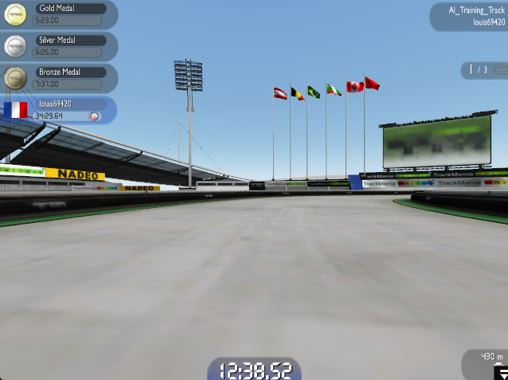
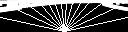

# TrackMania Nations Forever AI

This projects aims to design and implement a gym environnement running in real time on the game TrackMania Nations Forever, using TMInterface. The objective will then be to implement a bunch on different classic RL methods on this environnement.

# Game screen image analysis

I use MSS and the Win32 api to quickly take screenshots of the game window and then use a lot of post-processing using OpenCV to clean up the image to only keep the track borders.

The screenshot is then resized and the middle of it is kept to only keep the track borders. After that, the image is converted to grayscale and then to binary using a threshold. We apply a canny filter, then a dilation and finaly a gaussian blur before thresholding again.

Finally in order to get an input for our RL agents we simulate a LIDAR on the processed frame by tracing rays starting from the bottom middle of the processed image.

The input given to our agents can be either of these images or the array of distances computed from the raycasting.

# Receiving data from the game

In order to receive game data, we run the game through TMInterface. The game runs in its own process and a client to the interface is created in a Python thread, allowing use to continuously get information about the state of the game in a non-blocking way. The data that is gathered from the game is mainly used to compute the reward given by the environnement (current speed, yaw, pitch, roll, etc...)

# Simulating input

Instead of sending commands from the agent through TMInterface, I chose to simulate inputs as if they were made directly to the game as it allows to be independent from the actual interface Thread.

## Simulating arrow keys control

The arrow keys are simulated through the Win32 api for Python allowing us to send commands emulating a keyboard to the game's window. At each subsequent actions step we simulate a player holding the keys while the key is present in the action, when a key is no longer present in the action vector it is released. (This pattern was inspired by the implementation of TMRL)

## Simulating gamepad control

The game controller is simulated using VGamepad, allowing us to convert an agents continuous action space to analog controls on a controller (acceleration using analog triggers and steering with a joystick).

# Current Objectives

- [x] Extract and process frames from the game
- [x] Add raycasting observation
- [x] Send controls to the game using windows api
- [x] Get car status from TMInterface
- [x] Implement arrow keys input simulation
- [x] Implement gamepad input simulation
- [x] Run TMInterface in separate thread to get data from the game more efficiently
- [ ] Implement general training routines for most RL methods
  - [x] DQN with lidar inputs
  - [ ] DDPG with lidar inputs
  - [ ] PPO with lidar inputs
- [ ] Allow for online or offline training
- [ ] High level agent factory for easy testing
- [ ] WandB benchmarking tool and dashboard
- [ ] Main script and argument parsing
- [ ] (OPTIONAL) Look into implementing parallel envs by running multiple instances of the game
- [ ] (OPTIONAL) Automate setup of the game
  - [x] Game launched automatically after setting up virtual controller
  - [ ] Fully automated setup up to race start

# References

- TMInterface : https://donadigo.com/tminterface/
- TMRL : https://github.com/trackmania-rl/tmrl
- MSS : https://python-mss.readthedocs.io/
- VGamepad: https://github.com/yannbouteiller/vgamepad
